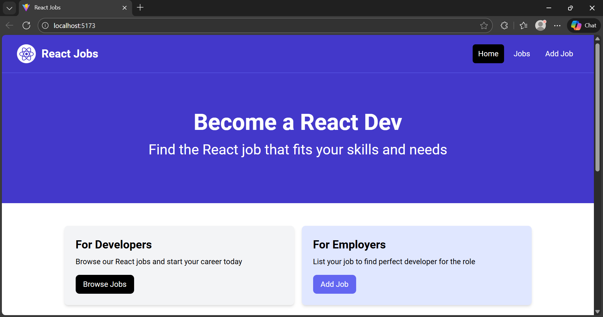
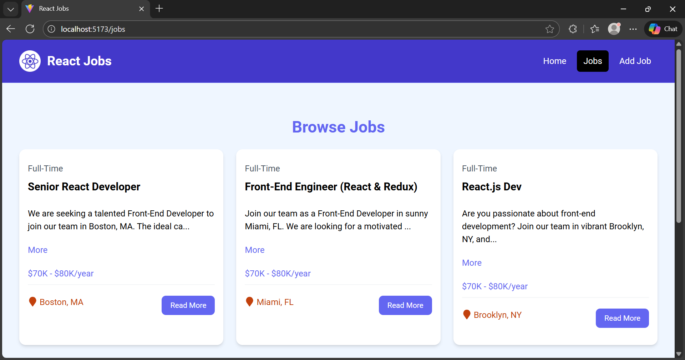
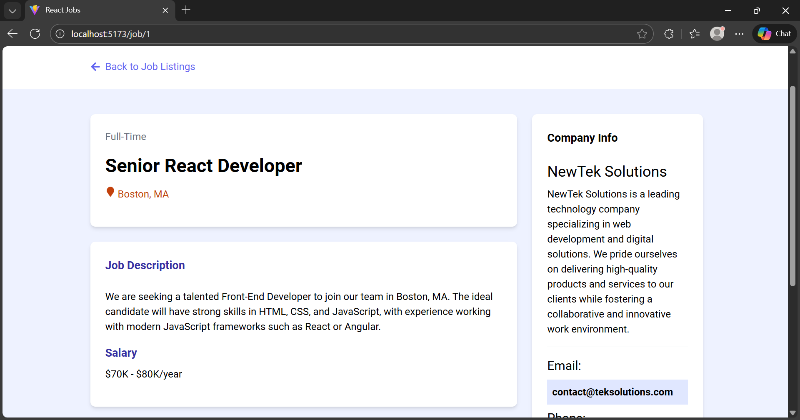

# React Jobs

A React-based web application designed to provide a simple and intuitive interface for browsing, adding, editing, and deleting job listings related to React and React Native roles.

## Features

* 💼 Browse available React & React Native job listings
* 📄 View detailed information for individual jobs
* ➕ Add new job postings
* ✏️ Edit existing job listings
* 🗑️ Delete job postings

## Screenshots

### Home Page



### Jobs Page



### Job Details Page



## Tech Stack

* **React (JavaScript)** – Component-based UI development
* **Vite** – Fast build tool and development server
* **React Router DOM** – Client-side routing
* **Tailwind CSS** – Utility-first styling and responsive design
* **JSON Server** – Local mock REST API

## Installation

### Prerequisites

Make sure you have completed the [Vite – Environment Setup](https://vite.dev/guide/) instructions.

### Step 1: Clone the Repository

```bash
git clone https://github.com/Hardik0602/React-Jobs.git
cd React-Jobs
```

### Step 2: Install Dependencies

```bash
npm install
```

### Step 3: Start the Local Backend

```bash
npm run server
```

### Step 6: Start the Development Server

```bash
npm run dev
```

## Dependencies

```json
{
  "react": "^19.2.0",
  "react-dom": "^19.2.0",
  "react-router-dom": "^7.11.0",
  "json-server": "^1.0.0-beta.3",
  "react-icons": "^5.5.0",
  "react-spinners": "^0.17.0",
  "react-toastify": "^11.0.5",
  "tailwindcss": "^3.4.19",
  "postcss": "^8.5.6",
  "autoprefixer": "^10.4.23",
  "vite": "^7.2.4",
  "@vitejs/plugin-react": "^5.1.1",
  "eslint": "^9.39.1"
}
```

## Key Features Implementation

### Job Listings

* Fetch and display job data from a local JSON Server
* Reusable job card components for clean UI

### Job Details

* Dedicated job detail pages using dynamic routes
* Job data fetched using URL parameters

### Job Management

* Full CRUD functionality (Create, Read, Update, Delete)
* Real-time UI updates after job actions

### UI / UX

* Mobile-first responsive design using Tailwind CSS
* Modular and reusable component structure
* Loading indicators and toast notifications for user feedback